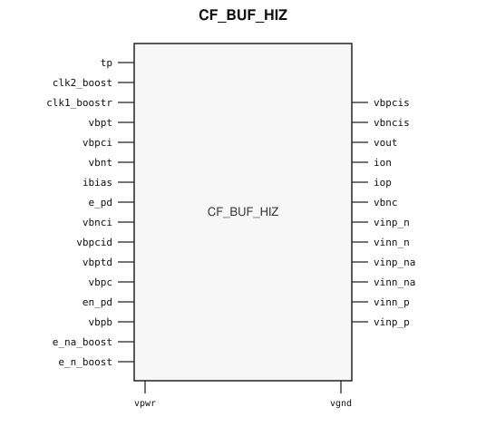

# CF_BUF_HIZ

> High-impedance differential input buffer

Draft for designer review. The public GDS is an abstract; ChipFoundry
substitutes protected full geometry at tapeout.

This package ships an SRAM-style PG wrap `CF_BUF_HIZ` around analog leaf
`CF_BUF_HIZ_core`.

## Overview

`CF_BUF_HIZ` is a SkyWater 130 nm hard macro that buffers a high-impedance
differential sensor into a converter front-end. Instantiate `CF_BUF_HIZ`.

Macro size is 246.52 × 419.97 µm (15 µm halo around analog leaf
216.52 × 389.97 µm). Customer PG for chip PDN is `vpwr` / `vgnd`. Vendor pads
`vpwr_a` / `vgnd_a` and well taps `vpb_a` / `vnb` are tied inside the wrap.

The protected leaf has two physical top-level islands for each of `ibias` and
`vbpt`. The public wrap places a via2 landing on both islands and joins each
pair with local met3. Integrators still connect one `ibias` port and one
`vbpt` port; no duplicate RTL pins or external straps are required.

## Installation

```bash
pip install cf-ipm
ipm install CF_BUF_HIZ --version 0.2.3 --include-drafts
```

Until the marketplace listing is published, install from a local catalog
override the same way `cf-sensor-afe` does:

```bash
ipm install CF_BUF_HIZ --version 0.2.3 --include-drafts --local-file ip/catalog.json
```

Use `hdl/gl/CF_BUF_HIZ.v` as the customer blackbox, `layout/lef/CF_BUF_HIZ.lef`
for P&R, and `layout/gds/CF_BUF_HIZ.gds` / `layout/mag/CF_BUF_HIZ.mag` for the
public wrap. `CF_BUF_HIZ_core` is the analog leaf (empty Verilog, pin-only
abstract). ChipFoundry substitutes vault GDS into `CF_BUF_HIZ_core` at tapeout.
P&R uses the wrap LEF (`vpwr` / `vgnd` only).

## Features

- High-impedance differential inputs (`vinp_*` / `vinn_*`)
- Analog output `vout`
- Bias current input `ibias`
- Active-high power-down `e_pd` / `en_pd`
- Boost clocks `clk1_boostr` / `clk2_boost` and enables `e_n_boost` / `e_na_boost`
- Customer cell `CF_BUF_HIZ` 246.52 × 419.97 µm (15 µm halo around analog leaf 216.52 × 389.97 µm)
- Chip PDN is `vpwr` / `vgnd`. Well taps `vpb_a` / `vnb` are tied inside the wrap.

## Pinout

Customer documentation includes a pinout of the integration cell only.
Internal schematics and architecture block diagrams are not published.



Pin names and directions match the public wrap (`layout/lef/CF_BUF_HIZ.lef`)
and the blackbox stub (`hdl/gl/CF_BUF_HIZ.v`).

## Pin Description

Directions and widths are taken from the shipped Verilog in `hdl/gl/CF_BUF_HIZ.v`.

| Name | Direction | Width | Description |
|---|---|---:|---|
| `tp` | input | 1 | Test / probe enable. |
| `clk2_boost` | input | 1 | Boost clock 2. |
| `clk1_boostr` | input | 1 | Boost clock 1. |
| `vbpt` | input | 1 | PMOS bias. |
| `vbpcis` | inout | 1 | Cascode PMOS bias. |
| `vbncis` | inout | 1 | Cascode NMOS bias. |
| `vout` | output | 1 | Buffered analog output. |
| `vbpci` | input | 1 | Cascode PMOS bias. |
| `vbnt` | input | 1 | NMOS bias. |
| `ibias` | input | 1 | Bias-current input. |
| `ion` | inout | 1 | Negative current node. |
| `iop` | inout | 1 | Positive current node. |
| `e_pd` | input | 1 | Power-down. |
| `vbnci` | input | 1 | Cascode NMOS bias. |
| `vbpcid` | input | 1 | Dummy cascode PMOS bias. |
| `vbptd` | input | 1 | Dummy PMOS bias. |
| `vbnc` | inout | 1 | NMOS cascode bias. |
| `vbpc` | input | 1 | PMOS cascode bias. |
| `en_pd` | input | 1 | Power-down enable. |
| `vbpb` | input | 1 | PMOS body / bias. |
| `vinp_n` | inout | 1 | Negative-path positive input. |
| `vinn_n` | inout | 1 | Negative-path negative input. |
| `vinp_na` | inout | 1 | Auxiliary negative-path positive input. |
| `vinn_na` | inout | 1 | Auxiliary negative-path negative input. |
| `vinn_p` | inout | 1 | Positive-path negative input. |
| `vinp_p` | inout | 1 | Positive-path positive input. |
| `e_na_boost` | input | 1 | Auxiliary-path boost enable. |
| `e_n_boost` | input | 1 | Negative-path boost enable. |
| `vpwr` | input | 1 | Core supply. |
| `vgnd` | input | 1 | Ground. |

`CF_BUF_HIZ_core` also has `vpwr_a`, `vgnd_a`, and well taps `vpb_a` / `vnb`.
The wrap ties `.vpwr_a(vpwr)`, `.vgnd_a(vgnd)`, `.vpb_a(vpwr)`, and `.vnb(vgnd)`.
Do not connect those pins at chip level.

In OpenLane / LibreLane, hook chip PDN with
`PDN_MACRO_CONNECTIONS: "u_cf_buf_hiz vccd1 vssd1 vpwr vgnd"` and connect
`.vpwr(vccd1)`, `.vgnd(vssd1)` under `USE_POWER_PINS`. Do not list `vpb_a` /
`vnb` / `vpwr_a` / `vgnd_a` on the wrapper instance.

## Limitations and Open Issues

- Verilog in `hdl/gl/CF_BUF_HIZ.v` is a structural wrap around an empty
  `CF_BUF_HIZ_core` blackbox, not a SPICE-accurate model.
- Liberty is not in this first wrap drop. P&R uses the wrap LEF.
- Companion foundry bias and pump cells stay foundry-only. This package
  ships the amplifier integration top.
- Bias companion macros are not placed in the 1-macro-first characterization
  vehicle. A sensor AFE that also instantiates `CF_BGR` / `CF_ADC_SAR12` is a
  follow-on.

## Tapeout History

| Version | Date | Notes |
|---|---|---|
| 0.2.0 | 2026-09-05 | SRAM-style PG wrap around analog leaf `CF_BUF_HIZ_core`. |
| 0.2.1 | 2026-09-18 | One Magic extract label per pin; do not east-extend disconnected analog slivers (`vbpt`). |
| 0.2.2 | 2026-09-19 | Fill waffle pin holes; grow `ibias` wrap seed for via2; relocate `vbpt` core label onto the vendor pad. |
| 0.2.3 | 2026-09-20 | Join split `ibias` and `vbpt` islands on wrap met3 so one RTL pin shorts both pads. |
